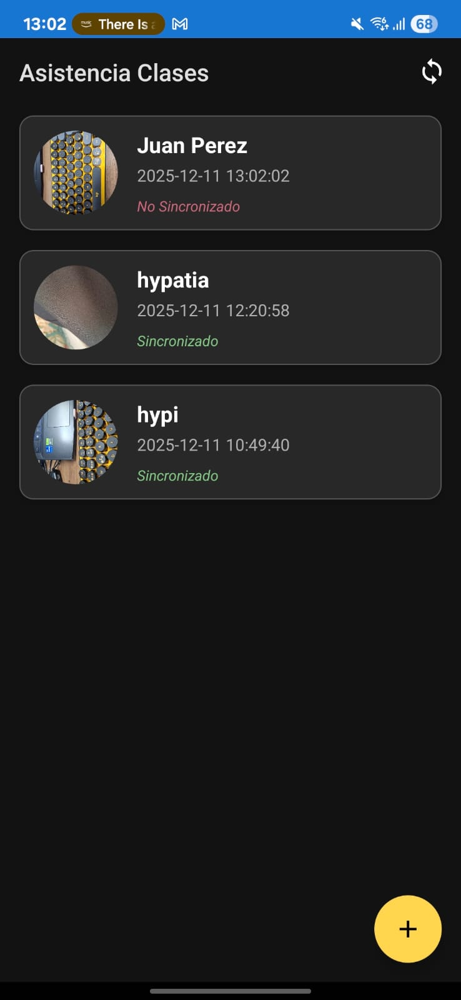
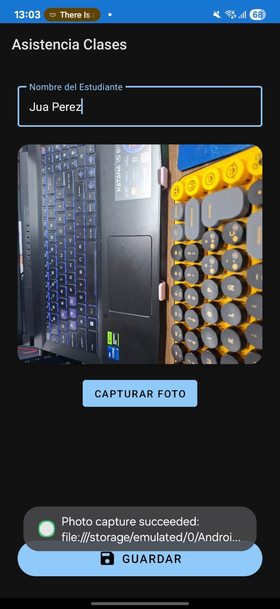
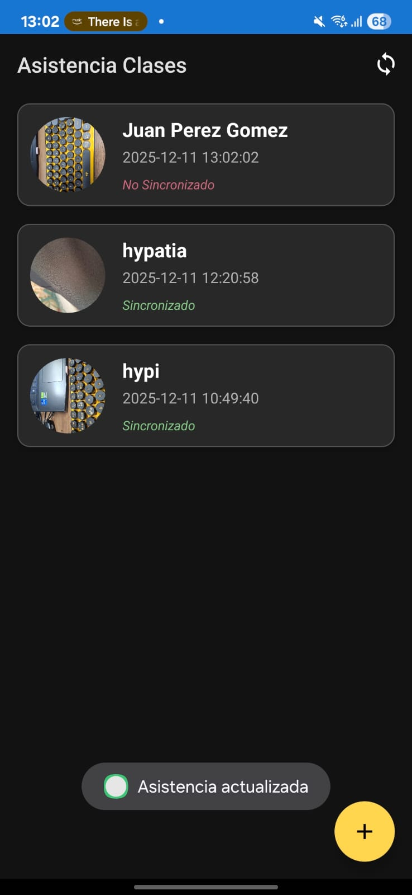
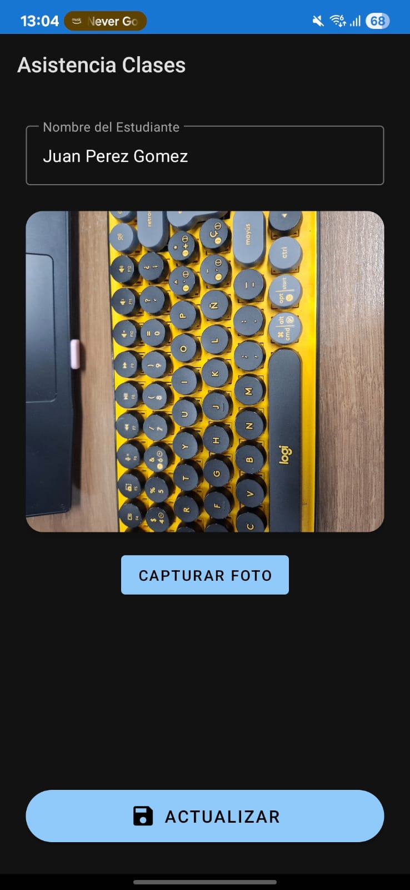
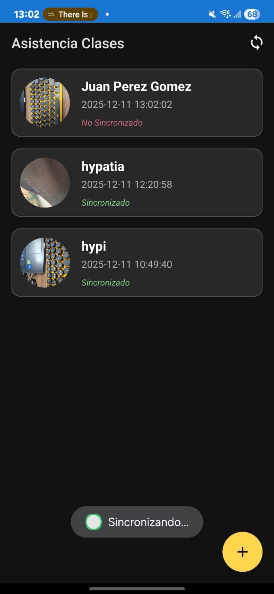
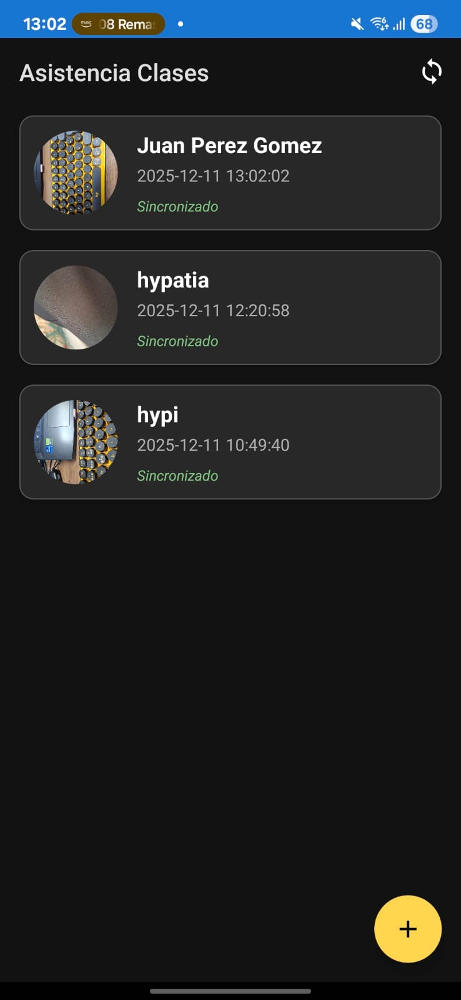

# Documentación de Pruebas - Asistencia Clases

**Alumno:** [Tu Nombre]
**Materia:** Programación II
**Fecha:** 2025

---

## 1. Prueba de Registro de Asistencia

**Descripción:** Verificar que se puede registrar una nueva asistencia con foto.

**Pasos:**
1.  Abrir la aplicación.
2.  Presionar el botón flotante (+).
3.  Ingresar el nombre "Juan Perez".
4.  Tomar una foto.
5.  Presionar "Guardar".

**Resultado Esperado:** Se regresa a la lista y aparece el nuevo registro.

**Captura de Pantalla:**
 

---

## 2. Prueba de Edición de Asistencia

**Descripción:** Verificar que se puede editar un registro existente.

**Pasos:**
1.  En la lista principal, tocar el registro de "Juan Perez".
2.  Cambiar el nombre a "Juan Perez Gomez".
3.  Presionar "Actualizar".

**Resultado Esperado:** El registro en la lista muestra el nuevo nombre.

**Captura de Pantalla:**
 

---

## 3. Prueba de Sincronización

**Descripción:** Verificar el envío de datos al servidor.

**Pasos:**
1.  Verificar que el registro tenga el texto "No Sincronizado" en rojo.
2.  En el menú superior, seleccionar "Sincronizar".
3.  Esperar el mensaje "Sincronización exitosa".

**Resultado Esperado:** El texto cambia a "Sincronizado" en verde.

**Captura de Pantalla:**

---

## 4. Prueba de Persistencia (Room)

**Descripción:** Verificar que los datos persisten al cerrar la app.

**Pasos:**
1.  Cerrar completamente la aplicación.
2.  Volver a abrirla.

**Resultado Esperado:** Los registros creados anteriormente siguen apareciendo en la lista.

**Captura de Pantalla:**

